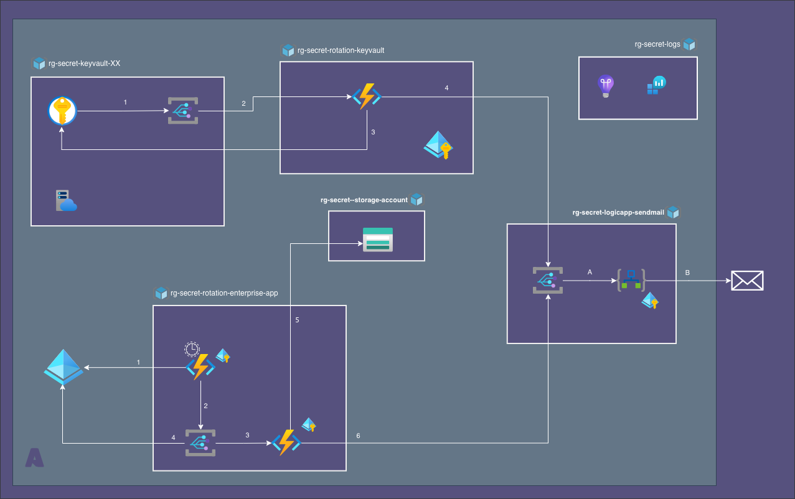
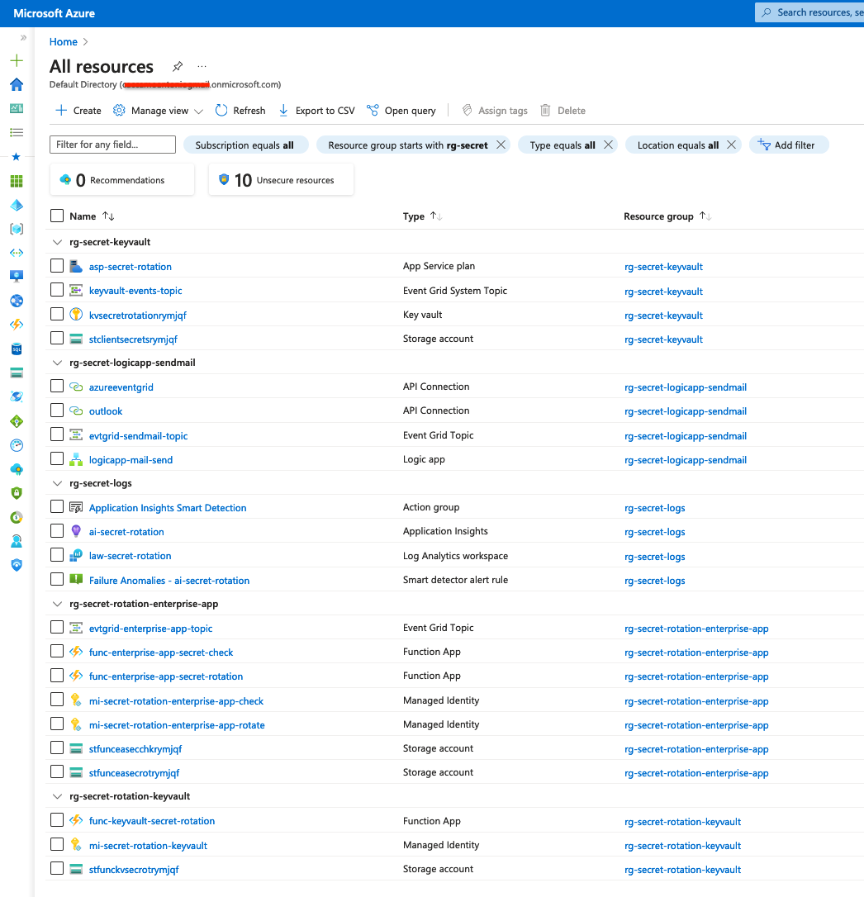
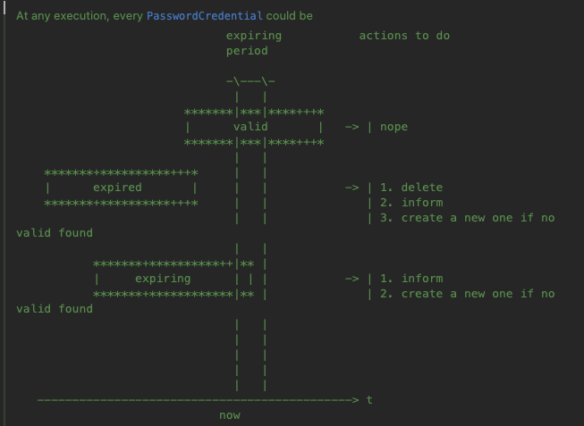
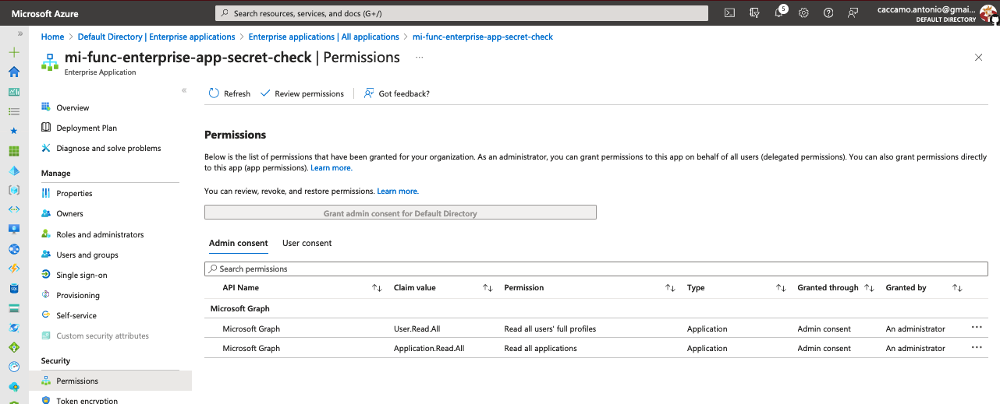

= Secret Rotation
:toc:
:sectnums:

== About

This project aims to implement the Secrets Rotation Process in a hypothetical Azure tenant.

It manages secrets stored in Key Vaults and those used as Password Credentials in Enterprise Apps

The system is composed by

. link:./lab-azure-secret-rotation-keyvault/README.adoc[Key Vault Secret Rotation] +
Manages secrets stored in Key Vaults

. link:./lab-azure-secret-rotation-enterprise-app/README.adoc[Enterprise Apps Secret Rotation] +
Manages secrets in Enterprise Apps PasswordCredentials

. link:./lab-azure-secret-rotation-logic-app/README.adoc[Logic App] +
Notify changes to secrets stakeholders

== View

The following picture represents the global view of involved Azure Services and how the components communicate to each others.

.Global View

=== Resources

Once all are deployed, we have the following resources:

.Azure Resources

== Open Points

. All
** [ ] Email Template
. Keyvaul Secret
** [*] New Secret version
** [*] Send event to next architecture step
. Enterprise Apps
[upperroman, start=1]
** Check
*** [*] Send event to next architecture step
*** [*] Decisional Algorithm
+

** Rotate
*** [*] Send event to next architecture step

. Logic App
** [*] Basic implementation done

== Reference

=== Azure Functions
IMPORTANT: https://www.red-gate.com/simple-talk/cloud/azure/azure-function-and-user-assigned-managed-identities/[Azure Function and User Assigned Managed Identities]

* https://learn.microsoft.com/en-us/azure/azure-monitor/app/opentelemetry-enable?tabs=java[]

* https://learn.microsoft.com/en-us/java/api/overview/azure/identity-readme?view=azure-java-stable#managed-identity-support[Azure Identity client library for Java - version 1.10.1]
* https://www.maxivanov.io/publish-azure-functions-code-with-terraform/[Publish Azure Functions code with Terraform]
* https://learn.microsoft.com/en-us/samples/azure-samples/function-app-arm-templates/function-app-linux-consumption/[Azure Function App Hosted on Linux Consumption Plan]
* https://learn.microsoft.com/en-us/azure/storage/common/storage-use-azurite?tabs=visual-studio-code[Use the Azurite emulator for local Azure Storage development]
* https://jordanbeandev.com/how-to-automatically-rotate-azure-ad-app-registration-client-secrets-using-azure-functions-with-java-and-key-vault/[How to automatically rotate Azure AD app registration client secrets using Azure Functions (with Java) and Key Vault]

=== Blob
. https://microsoft.github.io/AzureTipsAndTricks/blog/tip79.html[Creating an Azure Blob Hierarchy]

=== MS Graph

. https://learn.microsoft.com/en-us/graph/api/overview?view=graph-rest-1.0&preserve-view=true[Microsoft Graph REST API v1.0 endpoint reference]
. https://learn.microsoft.com/en-us/graph/permissions-reference[Microsoft Graph permissions reference]

=== Microsoft Graph API
* https://learn.microsoft.com/en-us/graph/api/application-list?view=graph-rest-1.0&tabs=http[MS Graph Rest API Application]

* https://medium.com/medialesson/how-to-send-emails-in-net-with-the-microsoft-graph-a97b57430bbd[How to send emails in .NET with the Microsoft Graph]

* https://blog.yannickreekmans.be/secretless-applications-add-permissions-to-a-managed-identity/[Secretless applications: add permissions to a Managed Identity
]

[appendix]
== User Assigned Managed Identity

// === Patch Azure function
//
// [source, bash]
// ----
// include::./src/script/patch.azure.function.sh[]
// ----

=== AAD Roles required

* User.Read.All
* Application.Read.All

.User Assigned Managed Identity Permissions

==== Valuable AZ Cli commands

[source, bash]
----
#!/bin/bash

set -xe

# get id for  User Assigned Identity principal
userAssignedIdentity="mi-secret-rotation-enterprise-app-check"
principalId=$(az ad sp list --display-name $userAssignedIdentity  --query "[0].id" -o tsv)

# get id for Microsoft Graph
graphId=$(az ad sp list --display-name 'Microsoft Graph' --query  "[0].id" -o tsv --all)

# retrieve id for require Microsoft Graph permissions
appRoles=( "User.Read.All" "Application.Read.All")
allowedMemberTypes=Application

# appRole loop
for appRole in "${appRoles[@]}"; do
  echo "assign \"$appRole\" to user assigned managed identity \"$userAssignedIdentity\""
  appRoleId=$(az ad sp list --display-name "Microsoft Graph" --query "[0].appRoles[?value=='$appRole' && contains(allowedMemberTypes, '$allowedMemberTypes')].id" -o tsv)
  echo "{ \"principalId\" : \"$principalId\", \"resourceId\"  : \"$graphId\", \"appRoleId\"   : \"$appRoleId\" }" > assign."$appRole".json
  az rest --method post \
    --uri https://graph.microsoft.com/v1.0/servicePrincipals/$principalId/appRoleAssignments \
    --body @assign.$appRole.json \
    --headers Content-Type=application/json
done
----

[appendix]
== Compare event solutions

[cols="1,1, 2,2"]
|====
| Service | Main Pattern | Pros | Cons

| *Event Hubs*
| Big data ingestion and streaming
| High-scale. Event persistence. Capturing events. Low-cost.
| An event can be received only once. Complex order support with multiple partitions. Server-managed cursor.
| *IoT Hub*
| Telemetry streaming
| Two-way communication. Device registration and settings management. Free Standard tier.
| No flexible pricing models. Sophisticated integration devices with Azure IoT Edge.
| *Notification Hubs*
| Event broadcasting
| Multi-platform support. Free tier.
| Lack of troubleshooting tools. A limited number of supported platforms.
| *Event Grid*
| Pub/Sub and reactive programming
| Consumption-based pricing. Integration with other services. Topic support.
| The events delivery sequence can be changed.
|====

[appendix]
== Local Development

Steps

. create infra for azure funct app
. deploy app
. infra for event grid subscription (manual for now)

1. install azure function core tool

[source, bash]
----
    brew tap azure/functions
    brew install azure-functions-core-tools@4
    # if upgrading on a machine that has 2.x or 3.x installed:
    brew link --overwrite azure-functions-core-tools@4
----

. start Azurite emulator

. start application
[source, bash]
----
mvn clean package  azure-functions:run
----

. call

[source, bash]
----
export FUNCTION_NAME=keyVaultSecretRotate

curl -i -X POST "http://localhost:7071/runtime/webhooks/eventgrid?functionName=$FUNCTION_NAME" \
      -d @event.grid.keyvault.payload.json \
      -H "Content-Type:application/json" \
      -H "aeg-event-type: Notification"
----

[source, bash]
----
export FUNCTION_NAME=keyvault-secret-rotate

curl -i -X POST "http://localhost:7071/runtime/webhooks/eventgrid?functionName=$FUNCTION_NAME" \
      -d @event.grid.keyvault.payload.near.expiry.json \
      -H "Content-Type:application/json" \
      -H "aeg-event-type: Notification"
----