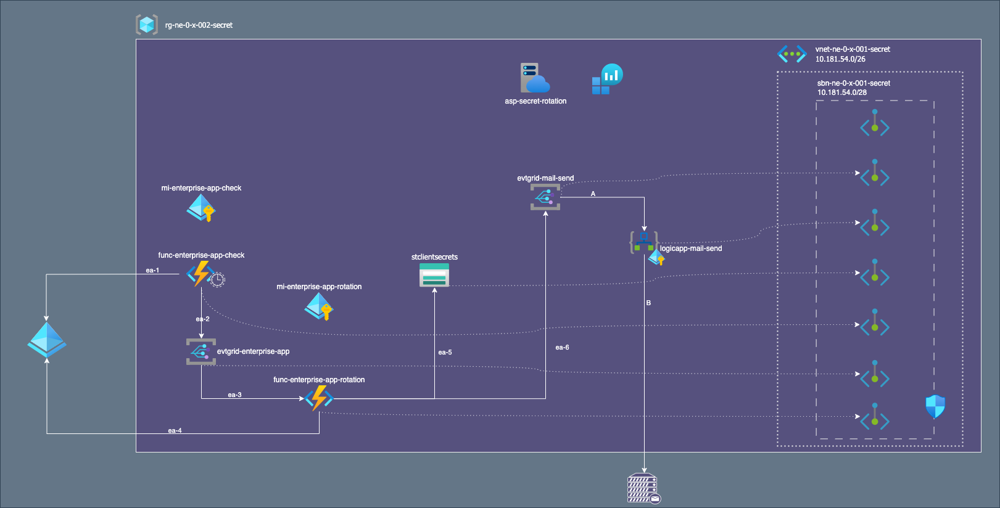

= Enterprise App Secret
:toc:
:sectnums:

== About
This section focuses on  secrets stored as PasswordCredentials of Enterprise Apps.

The `func-enterprise-app-secret-check`  is a scheduled function that checks if an entrerprise app has secrets that are near expiring or have expired.

The `func-enterprise-app-secret-rotate` rotates secrets and stores the new ones in a dedicated blobs in a storage account. +
The function grants access to blob only to app owner .

=== func-enterprise-app-secret-check

link:./lab-azure-secret-rotation-enterprise-app-check/README.adoc[func-enterprise-app-secret-check]

===  func-enterprise-app-secret-rotate

link:./lab-azure-secret-rotation-enterprise-app-rotate/README.adoc[func-enterprise-app-secret-rotate]

== View

Here below the view of Enterprise App Secret Rotation component.

.View

