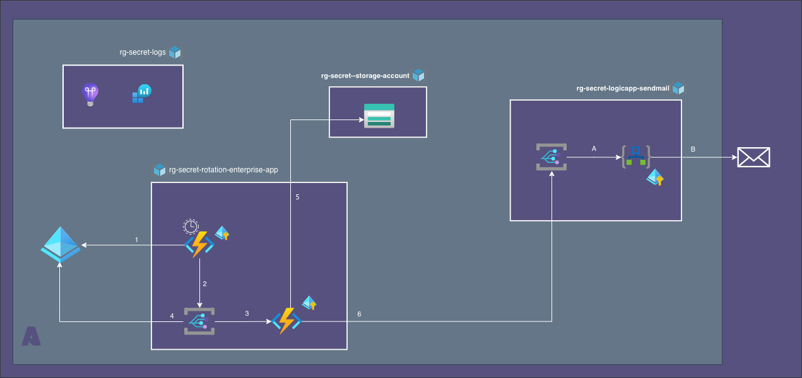
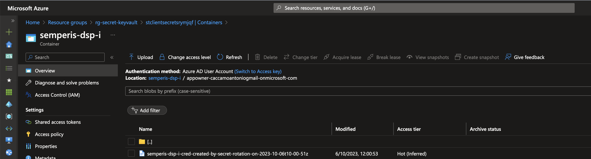

= func-enterprise-app-secret-rotate
:toc:
:sectnums:

== About

Manages the following Enterprise App Password Credential Events:

* `EnterpriseApp.PasswordCredentialNearExpiry`
* `EnterpriseApp.PasswordCredentialNearExpiryAndCreate`
* `EnterpriseApp.PasswordCredentialExpired`
* `EnterpriseApp.PasswordCredentialExpiredAndCreate`

received from the Enterprise App _Event Grid Topic_, implementing the following  actions

image::../../../docs/images/enterprise-app/strategy.enh.png[width=800]

In case of `EnterpriseApp.PasswordCredential*AndCreate`, a new Password Credential is created and its value wil be saved into blob
[horizontal]
name::  `<endusers-recipients>/<PasswordCredentialDisplayName>-created-by-secret-rotation-on-<utc-nowtime>`
container:: `ApplicationDisplayName`
storage account:: `STORAGE_ACCOUNT_NAME`.

Since Storage account access is managed by Azure Roles, for the owner upn, defined into `endusers-recipients` event data field, +
function assigns roles:

*  `READER`  with *storage account* scope
* `STORAGE_BLOB_DATA_READER`   with *blob container* scope

to permit owner to read the Password Credential value.

In any-case, it produces a new event representing the mail to be sending to owner.

Parameters:
[horizontal]
`ENTERPRISE_APPS_ROTATION_STORAGE_ACCOUNT_SUBSCRIPTION`:: subscription of storage account
`ENTERPRISE_APPS_ROTATION_STORAGE_ACCOUNT_RESOURCE_GROUP` :: resource group of storage account
`ENTERPRISE_APPS_ROTATION_STORAGE_ACCOUNT_NAME` :: name of storage account
`ENTERPRISE_APPS_ROTATION_VALID_FOR_DAYS` :: Days before expiring of the new Password Credential created
`EVENT_GRID_LOGIC_APP_MAIL_SEND_ENDPOINT`:: End point url of send mail event grid

== Data Flow

== Examples
.Blob created by this function

.Example of `EnterpriseApp.PasswordCredentialExpired` event received
[source, json]
----
{
  "id": "0c5bcc11-..................",
  "subject": "Application [semperis-dsp-i] PasswordCredential [semperis-dsp-i-cred]",
  "data": {
    "EXP": "2024-07-20T22:00:00Z",
    "ApplicationAppId": "69ba3c0e-..................",
    "PasswordCredentialDisplayName": "semperis-dsp-i-cred",
    "ApplicationId": "812debf6-..................",
    "ApplicationDisplayName": "semperis-dsp-i",
    "endusers-recipients": "upn.01.@exmple.com",
    "PasswordCredentialId": "a72f83c7-.................."
  },
  "eventType": "EnterpriseApp.PasswordCredentialExpired",
  "dataVersion": "1",
  "metadataVersion": "1",
  "eventTime": "2023-10-02T12:01:30.2659696Z",
  "topic": "/subscriptions/908894ac-................../resourceGroups/rg-......./providers/Microsoft.EventGrid/topics/evtgrid-.....-topic"
}
----

[appendix]
== Look up
[source, bash]
----

#
#az rest -m GET -u 'https://graph.microsoft.com/v1.0/applications?$search="displayName:lab-apim"&$count=true' --headers ConsistencyLevel=eventual > labs-apim.apps.list.json

#az rest --method GET --uri 'https://graph.microsoft.com/v1.0/applications?&$count=true$filter=startswith(displayName, "labs-apim")&$orderby=displayName' \
#  --headers ConsistencyLevel=eventual > labs-apim.apps.list.json

az rest -m get -u 'https://graph.microsoft.com/v1.0/users?$search="userPrincipalName:me.ext@caccamoantoniogmail.onmicrosoft.com"&$count=true' \
--headers ConsistencyLevel=eventual

userid=8d50632b-....

az rest -m get -u 'https://graph.microsoft.com/v1.0/users/$userid/ownedObjects/microsoft.graph.application'

----

[appendix]
== Assign roles
[source, bash]
----

# get id for  User Assigned Identity principal
userAssignedIdentity="mi-secret-rotation-enterprise-app-rotate"
principalId=$(az ad sp list --display-name $userAssignedIdentity  --query "[0].id" -o tsv)

# get id for
# graphId=$(az ad sp list --query "[?appDisplayName=='Microsoft Graph'].id | [0]" -o tsv --all)
graphId=$(az ad sp list --display-name 'Microsoft Graph' --query  "[0].id" -o tsv --all)

# retrieve id for require Microsoft Graph permissions
appRoles=( "User.ReadWrite.All" "Application.ReadWrite.All")
allowedMemberTypes=Application

# appRole loop
for appRole in "${appRoles[@]}"; do
  echo "assign \"$appRole\" to user assigned managed identity \"$userAssignedIdentity\""
  appRoleId=$(az ad sp list --display-name "Microsoft Graph" --query "[0].appRoles[?value=='$appRole' && contains(allowedMemberTypes, '$allowedMemberTypes')].id" -o tsv)
  echo "{ \"principalId\" : \"$principalId\", \"resourceId\"  : \"$graphId\", \"appRoleId\"   : \"$appRoleId\" }" > assign."$appRole".json
  az rest --method post \
    --uri https://graph.microsoft.com/v1.0/servicePrincipals/$principalId/appRoleAssignments \
    --body @assign.$appRole.json \
    --headers Content-Type=application/json
done
----

[appendix]
== Blob

[source, bash]
----
storageAccountName=stclientsecretsrymjqf
containerName=semperis-dsp-i
blobName=appowner-caccamoantoniogmail-onmicrosoft-com/created-by-secret-rotation-on-2023-10-05t09-38-39z

uploadFile=deps.txt

az storage container create \
  --name $containerName
  --account-name $storageAccountName -o table

az storage blob upload \
    --account-name $storageAccountName \
    --container-name $containerName  \
    --name $blobName \
    --file $uploadFile \
    --output table
----

