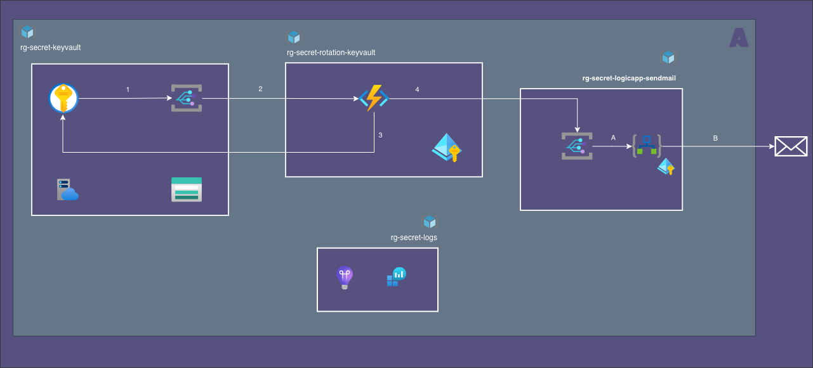
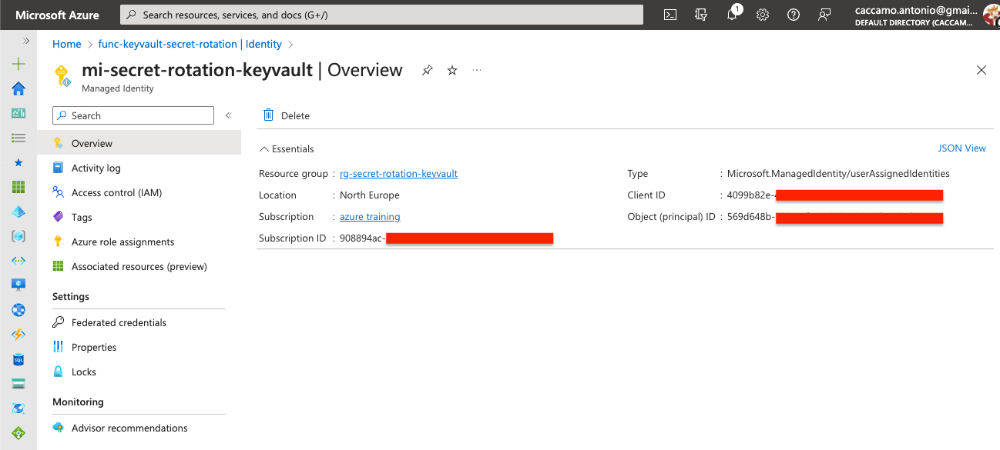
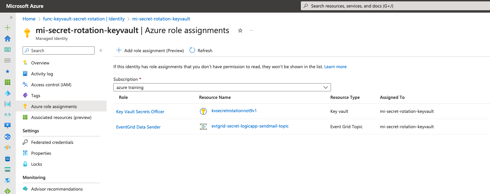
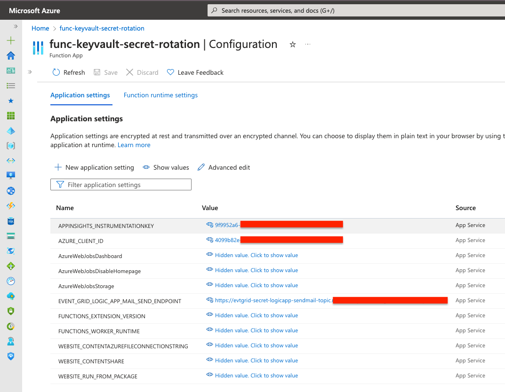

= func-keyvault-secret-rotation
:toc:
:sectnums:

== About
Manages the following Key Vault Secret Events:

* `Microsoft.KeyVault.SecretNearExpiry`
* `Microsoft.KeyVault.SecretExpired`

received from the Key Vault _Event Grid System Topic_.

In case of `Microsoft.KeyVault.SecretExpired`, generates a new random string and set it as new secret version.

In any-case, it produce a new event representing the mail to be sent to recipients defined in `endusers-recipients` secret tag.

Parameters:
[horizontal]
`KEYVAULT_SECRET_STRING_RANDOM_START`:: Integer representing left limit of each  generated char (default '0')
`KEYVAULT_SECRET_STRING_RANDOM_END`::  Integer representing right limit of each  generated char (default 'z')
`KEYVAULT_SECRET_STRING_RANDOM_LENGTH`::  Integer representing length of random string (default 20 chars)
`KEYVAULT_SECRET_DURATION`:: Duration of the new generated secret (default 90 days)
`EVENT_GRID_LOGIC_APP_MAIL_SEND_ENDPOINT`:: End point url of send mail event grid

== Data Flow

=== Snippets

.Code Snippet to produce a new secret value
[source, java]
----

String randomString = new SecureRandom()
    .ints(KEYVAULT_SECRET_STRING_RANDOM_START, KEYVAULT_SECRET_STRING_RANDOM_END)
    .limit(KEYVAULT_SECRET_STRING_RANDOM_LENGTH)
    .collect(StringBuilder::new, StringBuilder::appendCodePoint, StringBuilder::append)
    .toString();
System.out.println(randomString)

// =5<mN\mUvL;`7=yoAjda
----

.Secrets Versions and Tags
[rows="2"]
|===
a| image::../docs/images/keyvault/kv.secret.versions.png[]
a| image::../docs/images/keyvault/kv.secret.tags.png[]

|===

[appendix]
== Managed Identity

Configuration

.Managed Identity

.Role Assigments

.Configuration

// === Patch User Assigned Managed Identity Key Vault access
//
// See https://www.red-gate.com/simple-talk/cloud/azure/azure-function-and-user-assigned-managed-identities/[Azure Function and User Assigned Managed Identities]
//
// [source, bash]
// ----
// subscriptionId=$(az account show --query id -o tsv)
// resourceGroup=rg-secret-rotation
// funcName=
// funcId=$(az webapp show -g ${resourceGroup} -n ${funcName}  --query id  -o tsv)
// userAssignedIdentity=mi-secret-rotation
//
// # build patch body
// cat << EOF > funcpatch.json
// {
//   "properties": {
//     "keyVaultReferenceIdentity": "/subscriptions/${subscriptionId}/resourcegroups/${resourceGroup}/providers/Microsoft.ManagedIdentity/userAssignedIdentities/${userAssignedIdentity}"}
// }
// EOF
//
// # call
// az rest --method PATCH --uri "${funcId}?api-version=2021-01-01" --body @func.patch.json
// ----

