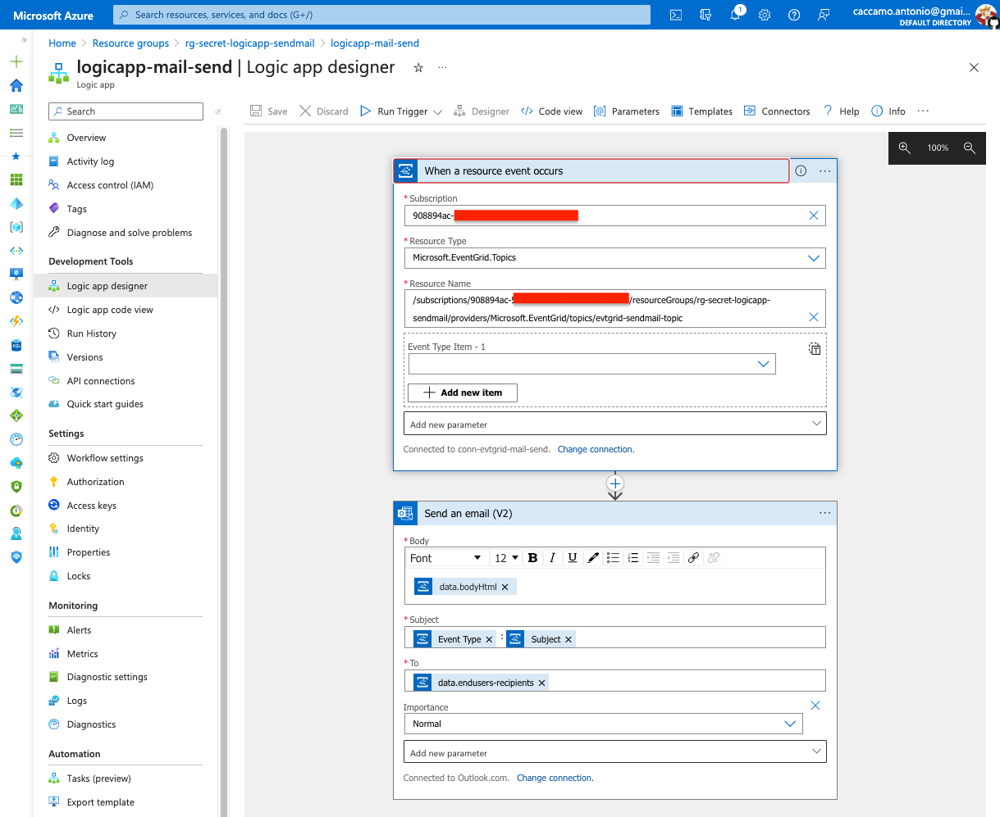
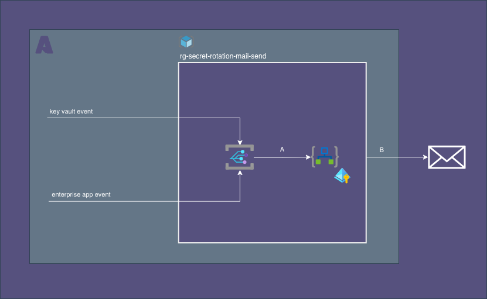

= Logic App Mail Send
:toc:
:sectnums:

== About

For simplicity, this Logic App sends mail with
[horizontal]
subject:: as `eventType` and `subject` event field
recipient:: as `endusers-recipients`  data event  field
body:: as `bodyHtml`  data event  field

.Design of mail send logic app

== Data Flow

[source, bash]
----
export subscriptionId=$(az account show --query id -o tsv)
export resourceGroup=rg-secret-rotation
export eventGridTopicMailSend= ...

envsubst < java/logic-app/code.json

# concat(triggerBody()['data']['end-usersrecipients'], ';', 'xxx.yyy@zzz.com')
----

== Examples

.Example for `KeyVault` event received
[source, json]
----
{
  "id": "89bb4c0d-...............",
  "subject": "secret02",
  "data": {
    "Id": "https://kvsecretr..........vault.azure.net/secrets/secret02/b1c..................",
    "VaultName": "kvsecretrotationrymjqf",
    "ObjectType": "Secret",
    "ObjectName": "secret02",
    "Version": "b1c4dce0151d4072b1cf2c8585a7ade3",
    "EXP": 1696244400,
    "endusers-recipients": "antonio.caccamo@xxxxxxx.com;caccamo.antonio@yyyyyyyyy.com",
    "bodyHtml": "keyvault [https://kvsecr........vault.azure.net]\nsecret [secret02] : created on 2023-10-02T11:03:32.0Z not before 2023-10-02T11:03:32.0Z and will expire on 2023-12-31T11:03:32.0Z\n\n"
  },
  "eventType": "Microsoft.KeyVault.SecretExpired",
  "dataVersion": "1",
  "metadataVersion": "1",
  "eventTime": "2023-10-02T11:03:32.8505573Z",
  "topic": "/subscriptions/908894ac-.............../resourceGroups/rg-secret-...............-sendmail/providers/Microsoft.EventGrid/topics/evtgrid-...............-topic"
}
----

.Example for `EnterpriseApp` event received
[source, json]
----
{
  "id": "e5dfc962-...............",
  "subject": "Application [ne-function-test-ad] PasswordCredential [oauth-client-secret]",
  "data": {
    "endusers-recipients": "appowner@xxxxxxxxxxxx.onmicrosoft.com",
    "ApplicationDisplayName": "ne-function-test-ad",
    "ApplicationId": "00882e12-...............",
    "PasswordCredentialDisplayName": "oauth-client-secret",
    "ApplicationAppId": "7845726-...............",
    "EXP": "2023-03-20T17:02:14.249000000Z",
    "PasswordCredentialId": "54937e77-7e38-4c16-be25-3d023fdc2823",
    "subject": "Application [ne-function-test-ad] PasswordCredential [oauth-client-secret]",
    "eventType": "EnterpriseApp.PasswordCredentialExpired",
    "bodyHtml": "<!DOCTYPE html>\n<html lang=\"en\">\n<head>\n    <meta charset=\"UTF-8\">\n    <meta name=\"viewport\" content=\"width=device-width, initial-scale=1.0\">\n    <meta http-equiv=\"X-UA-Compatible\" content=\"ie=edge\">\n</head>\n<body>\n
\n    The application <a href=\"https://portal.azure.com/#view/Microsoft_AAD_RegisteredApps/ApplicationMenuBlade/~/Credentials/appId/78457269--...............\"><b>ne-function-test-ad</b><a/>\n     \n    has password credential <b>oauth-client-secret</b> that is expired on 2023-03-20T17:02:14.249000000Z.\n
\n\n
\n    A new one called <b>oauth-client-secret-created-by-secret-rotation-on-2023-10-06T12:00:51Z</b> has been created on and will expire on 2024-04-03T12:00:51.635039200Z, \n    and its value could be found at 
\n
\n<dl>\n    <dt>storageAccount</dt>\n    <dd>stclientsecretsrymjqf</dd>\n    <dt>containerName</dt>\n    <dd>ne-function-test-ad</dd>\n    <dt>blob</dt>\n    <dd>appowner-xxxxxxxxxxx-onmicrosoft-com/oauth-client-secret-created-by-secret-rotation-on-2023-10-06t12-00-51z</dd>\n</dl>\n\n
\n</body>\n</html>"
  },
  "eventType": "EnterpriseApp.PasswordCredentialExpired",
  "dataVersion": "1",
  "metadataVersion": "1",
  "eventTime": "2023-10-06T12:00:59.2983468Z",
  "topic": "/subscriptions/908894ac-5f7e-.............../resourceGroups/rg--.............../providers/Microsoft.EventGrid/topics/evtgrid-...............-topic"
}
----